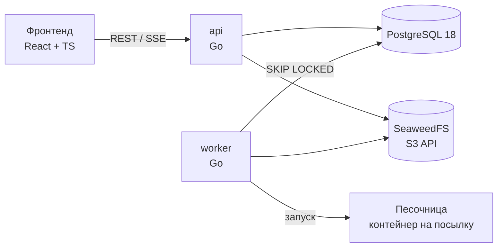

# Архитектура

Система принимает исходный код студента, компилирует и запускает его в изолированной
среде на наборе тестов с ограничением времени и памяти, сохраняет результат и формирует
отчёт об ошибках.

## Компоненты

| Компонент | Что делает |
|---|---|
| **api** | Авторизация, задания и тесты, приём посылок, выдача результатов и отчётов, статус в реальном времени (SSE). |
| **worker** | Забирает посылку из очереди, компилирует и запускает её в песочнице на каждом тесте, сравнивает вывод чекером, пишет результаты. Масштабируется числом реплик. |
| **migrate** | Применяет миграции схемы при деплое (`migrate up` / `migrate down`). |
| **PostgreSQL** | Все данные и очередь проверок. |
| **SeaweedFS** | Исходники, входные/эталонные данные тестов, кастомные чекеры, сохранённый вывод открытых тестов, экспортированные отчёты. S3-совместимый API. |
| **Песочница** | Отдельный контейнер на каждую посылку: без сети, read-only rootfs, непривилегированный пользователь, seccomp, лимиты cgroups v2 на CPU, память и число процессов. |

## Принятые решения

**Очередь на PostgreSQL, а не NATS/Redis.** Воркер забирает задание запросом
`SELECT … FOR UPDATE SKIP LOCKED` из таблицы `judge_jobs`. При наших объёмах (сотни посылок
в час) этого достаточно. Нет лишнего сервиса для деплоя и мониторинга, а постановку задания
в очередь можно делать в одной транзакции с созданием посылки, так что посылка не потеряется
между БД и брокером. Если упрёмся в производительность, перейдём на NATS JetStream: интерфейс
очереди в коде будет один.

**Файлы в S3, а не в БД.** Тесты бывают по десяткам мегабайт, и в Postgres они раздували бы
бэкапы. В БД храним только ключи объектов (`*_key`).

**SeaweedFS вместо MinIO.** S3-совместимое хранилище под лицензией Apache 2.0. В dev оно
поднимается одним контейнером, в проде компоненты (master, volume, filer, s3) разносятся.

**Языки задаются данными.** Таблица `languages` хранит образ песочницы и команды компиляции
и запуска. Обновить компилятор или добавить язык (в том числе по запросу из формы обратной
связи) можно без релиза бэкенда.

**UUIDv7 в качестве ключей.** Встроенная функция `uuidv7()` в PostgreSQL 18: ключи
упорядочены по времени (индексы не фрагментируются), и их нельзя перебрать в URL.

## Подробнее

- Схема БД и жизненный цикл посылки: [backend/docs/database.md](https://github.com/autocheck-team/backend/blob/main/docs/database.md)
